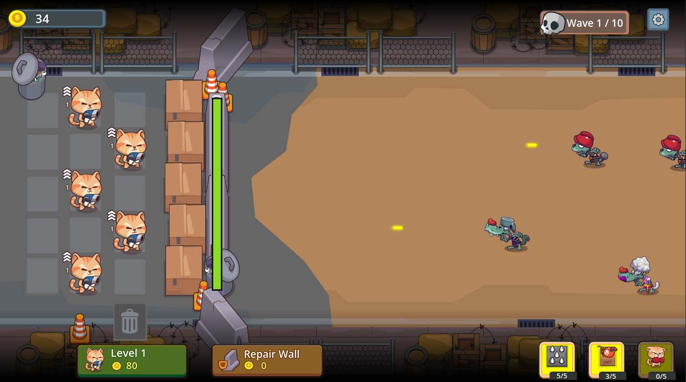

# Cat Defense (Merge Cats Defender)

A merge-and-defend mobile game built in **Godot 4.7 (Mobile)**.

## Download

Get the latest Android build here: [CatDefense.apk](https://github.com/xocdr/cat-defense/releases/download/v0.2.0/CatDefense.apk)

## Gameplay

Merge cats to grow their power, then defend your wall against waves of incoming enemies:

- **Merge**: Drag and drop cats onto each other in a 5x2 grid — matching levels merge into a stronger cat, while other drops swap or move cats around the board. A trash cell lets you sell cats you don't need.
- **Buy**: Spend in-match coins to buy new cats into free slots; the cost and starting level rise as you progress.
- **Defend**: Cats automatically attack enemies row-by-row while a crate wall blocks enemies from reaching the end. Enemies that break through the wall keep walking — if any reach the far side, you lose the match.
- **Waves**: Each level runs 10 waves of enemies, with a tougher boss every 5th wave. Clearing all 10 wins the level and unlocks the next. Some enemies carry armor (damage reduction) or a boss heal-pulse ability.
- **Items**: Arm and place spikes, TNT, a boxing-cat blocker, or a poison cloud to turn the tide of a wave.
- **Weapon archetypes**: Cat characters cycle through Pistol/Shotgun/Rifle/Sniper archetypes that trade fire rate against per-shot damage, so different characters feel like different guns rather than palette swaps.
- **Hunt mode**: A separate cross-shaped board reachable from the level map's HUNT button, where cats aren't confined to their own lane.
- **Lobby**: Between matches, spend gems to permanently upgrade each cat character's damage/fire-rate/range, unlock new characters with treats (an in-match-earned, free-to-play currency) as your best merge level rises, and buy consumable items or card packs.

## Project structure

This is a Godot project with no external build system or package manifest — open `project.godot` in the Godot 4.7 editor and press Play (main scene: `scenes/LoadingScreen.tscn`).

- `scripts/` — gameplay and UI logic (`main.gd`, `cat.gd`, `enemy.gd`, `wall.gd`, `lobby.gd`, `game_state.gd`, ...)
- `scenes/` — Godot scene files
- `Ai/`, `Eps/`, `Png/`, `Json Atlas/`, `Spine/` — source art assets (originally a CraftPix pack), organized in parallel by format
- `Preview/`, `samples/` — UI/gameplay design mockups
- `sfx/` — sound effects

See `CLAUDE.md` for a detailed architecture overview and asset conventions.

## Licensing

Art assets are from CraftPix — see `license.txt` before reuse or redistribution.
